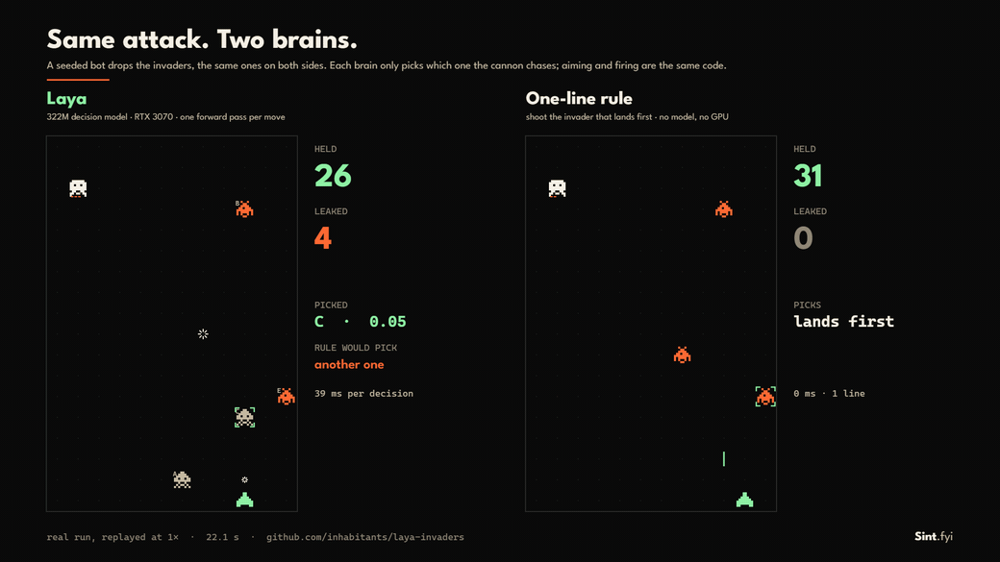

# laya-invaders

**English** · [Português](README.pt-BR.md)

Space Invaders, flipped, as a test for a decision model. You (or a bot) drop the invaders. [Laya](https://github.com/NandhaKishorM/laya), a 322M decision model by Convai Innovations, only picks which one the cannon chases. Next to it, the same attack faces a one-line rule: shoot the invader that lands first.



*A real run on an RTX 3070, replayed at 1×. Same seeded attack on both sides.*

## Why this test

Laya answers typed questions with probabilities in one forward pass, with zero output tokens. In the Snake demo ([laya-snake-cuda](https://github.com/inhabitants/laya-snake-cuda)) a planner writes "Best" next to one of the options, so that demo shows speed and format, not judgment. Here Laya gets a real call: which threat first.

## What keeps it fair

- **Facts, not advice.** Each invader is offered as plain facts: kind, how far from the cannon, ticks until it lands, hits it takes. For example: `tank, 3 columns to the left, lands in 42 ticks, needs 3 hits`. No option is marked as the best one.
- **Order says nothing.** When more than 5 invaders are on screen, the 5 closest to landing are offered, listed left to right.
- **Same hands.** Aiming and firing are plain code, identical for both sides. The only thing that differs is who picks the target.
- **Same attack.** The attacker is a seeded bot that never looks at the defense, so the same seed drops the same invaders at the same ticks, whoever defends.

Laya also answers a second question in the same pass (pressure: calm, busy or overwhelmed). The panel shows it; the cannon doesn't use it.

## Results

Same seed for both, 600 ticks (60 seconds of game):

| Attack | Rule (lands first) | Laya | Picks in common |
|---|---|---|---|
| Normal | 52 of 52 | 50 of 52 | 86% |
| Double energy for the attacker | 87 of 89 | 71 of 87 | 35% |

About 50 ms per Laya decision on the RTX 3070. The rule wins, and the gap grows with the pressure. The runs are deterministic: the same seed gave the same numbers twice.

Fast and well-formed is not the same as good at weighing. Keep a dumb baseline next to any decision model.

## Run it

Python 3.10 or newer.

```bash
git clone https://github.com/inhabitants/laya-invaders
cd laya-invaders
python -m venv .venv
```

Activate it (`.venv\Scripts\activate` on Windows, `source .venv/bin/activate` on Linux), then:

```bash
# NVIDIA GPU: install a CUDA build of PyTorch first (RTX 50 series needs cu128 or newer)
pip install torch --index-url https://download.pytorch.org/whl/cu128
pip install -r requirements.txt
python server.py --download
python server.py
```

`--download` fetches the multilingual checkpoint (~0.65 GB) into `./models/laya`, pinned to the revision these numbers came from. Then open http://127.0.0.1:8765. The server listens on your machine only. No GPU: skip the torch line and add `--device cpu` (around 300 ms per decision; press `-` to slow the game down).

| Key | |
|---|---|
| **Click** a column | Drop an invader there |
| **1 2 3** | Pick the kind: runner, zigzag, tank |
| **M** | Swap the brain between Laya and the rule |
| **T** | Turn the bot attacker on or off |
| **Space** / **R** / **+ -** | Pause / reset / speed |

Portuguese on screen: http://127.0.0.1:8765/?lang=pt

## Repeat the bench

In the browser console:

```js
layaInvaders.run({ ticks: 600, seed: 1, energyEvery: 3 })  // about 2 minutes
layaInvaders.summary()
```

`energyEvery: 6` is the normal attack, `3` the double one. To export the side-by-side replay, start the server with `--frames-dir frames`, run the bench, then `layaInvaders.exportRun({ from: 0, to: 600 })` and turn the frames into video:

```bash
ffmpeg -framerate 10 -i frames/f%05d.png -r 30 -c:v libx264 -crf 20 -pix_fmt yuv420p replay.mp4
```

## Status

Published as is, not maintained. Tested on Windows 11, Python 3.11, PyTorch 2.11 (CUDA 13), `laya` 0.3.5, RTX 3070. The page loads the League Spartan font from Google Fonts.

## License

MIT for this code, see [LICENSE](LICENSE). Laya and its weights are Apache-2.0 by Convai Innovations; the weights are downloaded separately and are not included here.

---

Made at [Sapiens Sintéticos](https://www.sapiensinteticos.com).
