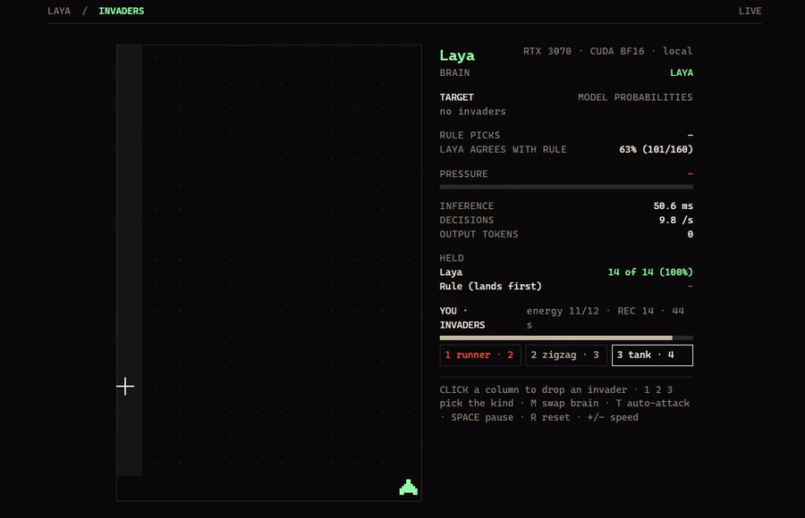

# laya-invaders

[English](README.md) · **Português** · [Site](https://www.sapiensinteticos.com/laya-invaders?lang=pt)

Humano contra máquina, na sua própria placa de vídeo. Space Invaders ao contrário: o seu PC é a Terra, você é o invasor, e o [Laya](https://github.com/NandhaKishorM/laya), um modelo de decisão pequeno da Convai Innovations, defende escolhendo qual invasor o canhão persegue.



*Ao vivo numa RTX 3070. O painel mostra as opções que o Laya recebe, as probabilidades dele e quando ele discorda da regra.*

Inspirado no demo da cobrinha que o [mizorewww/laya-mlx](https://github.com/mizorewww/laya-mlx) criou pro Laya no Apple Silicon, que a gente portou pra NVIDIA e CPU no [laya-snake-cuda](https://github.com/inhabitants/laya-snake-cuda). Aquele demo mostra quão rápida é uma decisão tipada. Este pergunta se a decisão presta.

## Por que este teste

O Laya é um modelo de 322M que não escreve texto: ele responde perguntas tipadas com probabilidades numa passada só, com zero token de saída. É a versão aberta dos modelos de decisão de "pensamento rápido" que produtos como o Jev prometem. Na cobrinha um planejador escreve "Best" do lado de uma das opções, então o modelo nunca precisa julgar. Aqui precisa: qual ameaça primeiro.

## O que deixa o teste justo

- **Fato, não conselho.** Cada invasor chega como fato: o tipo, a distância do canhão, quantas rodadas faltam pra pousar e quantos tiros aguenta. Por exemplo: `tank, 3 columns to the left, lands in 42 ticks, needs 3 hits`. Nenhuma opção vem marcada como a melhor.
- **A ordem não diz nada.** Quando tem mais de 5 invasores na tela, entram os 5 mais perto de pousar, listados da esquerda pra direita.
- **As mesmas mãos.** Mirar e atirar é código comum, igual pros dois lados. A única coisa que muda é quem escolhe o alvo.
- **O mesmo ataque.** Cada invasor que você solta é gravado com a rodada em que aconteceu. O teste reproduz o seu ataque exato contra o Laya e contra a régua, uma regra de uma linha: atira no invasor que pousa primeiro.

O Laya também responde uma segunda pergunta na mesma passada (pressão: tranquila, apertada ou sufocada). O painel mostra; o canhão não usa.

## Resultado

**Um ataque humano, 24 invasores**, reproduzido invasor por invasor contra os dois cérebros:

| Cérebro | Segurou | Passou |
|---|---|---|
| Regra de uma linha (pousa primeiro) | 23 | 1 |
| Laya | 22 | 2 |

Os dois escolheram o mesmo alvo em 64% das vezes, a uns 57 ms por decisão do Laya. Os 22 de 24 do Laya na reprodução batem com o que o painel mostrou ao vivo enquanto o ataque acontecia.


**Um bot com semente apertando mais**, 600 rodadas, o mesmo ataque pros dois:

| Ataque | Regra | Laya | Escolhas em comum |
|---|---|---|---|
| Normal | 52 de 52 | 50 de 52 | 86% |
| Energia dobrada pro atacante | 87 de 89 | 71 de 87 | 35% |

A regra ganha, e a diferença cresce com a pressão. As partidas são determinísticas: o mesmo ataque dá os mesmos números toda vez.

Rápido não quer dizer que sabe pesar: modelo de decisão só prova que vale com uma regra burra do lado.

## Rodar

Python 3.10 ou mais novo.

```bash
git clone https://github.com/inhabitants/laya-invaders
cd laya-invaders
python -m venv .venv
```

Ative (`.venv\Scripts\activate` no Windows, `source .venv/bin/activate` no Linux) e depois:

```bash
# Placa NVIDIA: instale antes um PyTorch com CUDA (RTX série 50 pede cu128 ou mais novo)
pip install torch --index-url https://download.pytorch.org/whl/cu128
pip install -r requirements.txt
python server.py --download
python server.py
```

O `--download` baixa o checkpoint multilíngue (~0,65 GB) em `./models/laya`, travado na revisão de onde saíram estes números. Depois abre http://127.0.0.1:8765. O servidor só escuta na sua máquina. Sem placa: pule a linha do torch e acrescente `--device cpu` (uns 300 ms por decisão; aperte `-` pra deixar o jogo mais lento).

| Tecla | |
|---|---|
| **Clique** numa coluna | Solta um invasor ali |
| **1 2 3** | Escolhe o tipo: corredor, zigue-zague, tanque |
| **M** | Troca o cérebro entre o Laya e a regra |
| **T** | Liga ou desliga o bot atacante (o que o bot solta não é gravado) |
| **Espaço** / **R** / **+ -** | Pausa / nova gravação / velocidade |

Tela em português: http://127.0.0.1:8765/?lang=pt

## Reproduzir o seu ataque

Enquanto você joga, o painel mostra `REC` e cada invasor fica salvo em `attacks/` (um arquivo por sessão, mais o `latest.json`). Quando terminar, no console do navegador:

```js
layaInvaders.runHuman()   // o seu último ataque contra os dois cérebros
layaInvaders.summary()
```

Pro teste com bot: `layaInvaders.run({ ticks: 600, seed: 1, energyEvery: 3 })` (`6` é o ataque normal, `3` o dobrado). Pra exportar a reprodução lado a lado, suba o servidor com `--frames-dir frames`, rode um teste, depois `layaInvaders.exportRun({ from: 0, to: 600 })` e transforme os quadros em vídeo:

```bash
ffmpeg -framerate 10 -i frames/f%05d.png -r 30 -c:v libx264 -crf 20 -pix_fmt yuv420p replay.mp4
```

## Estado

Publicado como está, sem manutenção. Testado no Windows 11, Python 3.11, PyTorch 2.11 (CUDA 13), `laya` 0.3.5, RTX 3070. A página carrega a fonte League Spartan do Google Fonts.

## Licença

MIT pra este código, veja [LICENSE](LICENSE). O Laya e os pesos dele são Apache-2.0, da Convai Innovations; os pesos são baixados à parte e não estão incluídos aqui.

---

Feito no [Sapiens Sintéticos](https://www.sapiensinteticos.com).
